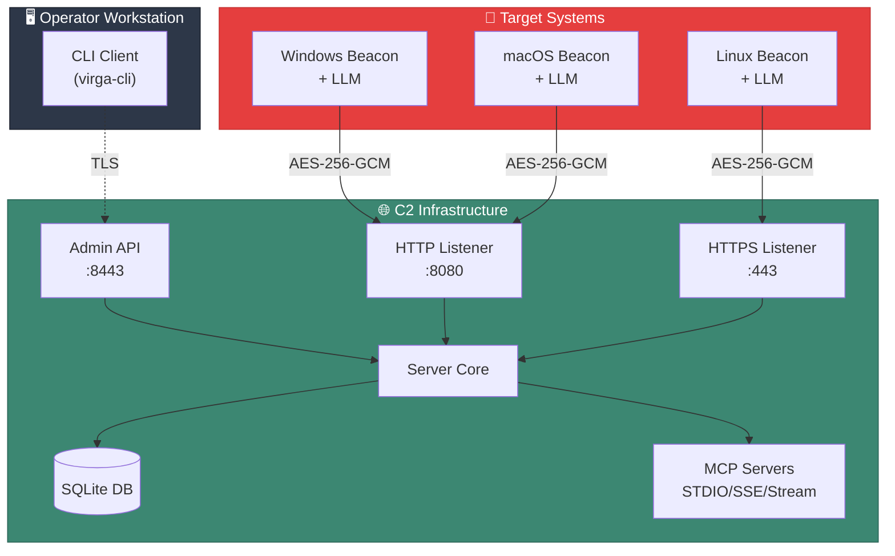

# Introduction

Welcome to Virga! This document provides a high-level overview of the framework and its capabilities.

## What is Virga

Virga lightweight, post-exploitation C2 (Command and Control) framework designed for security professionals. It is built with Go for high performance and cross-platform compatibility, supporting Windows, Linux, and macOS.

A key feature of Virgats integrated AI, powered by an embedded LLM. This allows for autonomous operations, such as reconnaissance and data analysis, directly on the target system.

## Architecture Overview

## Next Steps

- To install Virgaceed to the [Installation](/guide/installation) guide.
- To get hands-on experience, follow the [Quick Start](/guide/quick-start) tutorial.