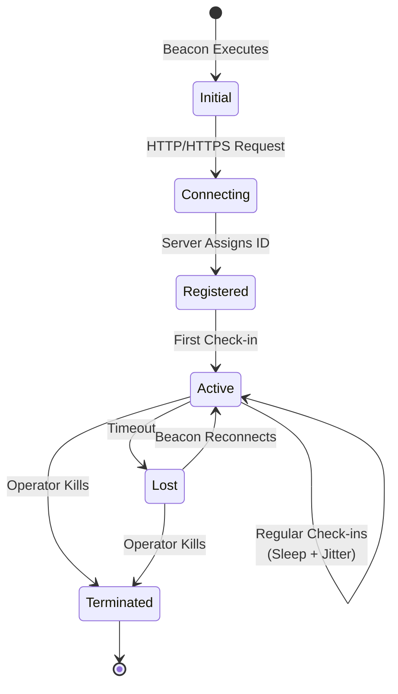

# Session Management

This guide covers session management in Virga, including how beacon sessions are tracked, managed, and interacted with.

## Overview

A session represents an active connection from a beacon to the C2 server. Each session is a stateful object on the server that allows operators to:

- Track real-time beacon status.
- Issue commands and manage tasks asynchronously.
- Transfer files to and from the target.
- View metadata collected from the target system.

## Session Lifecycle

The lifecycle of a session from initial execution to termination:



## Session Information

Each session on the server holds metadata about the beacon. This information is updated with each check-in.

**Key Session Fields:**
- **ID / BeaconID**: The unique identifier for the beacon session.
- **IP**: The source IP address of the beacon.
- **Hostname**: The hostname of the target system.
- **Username**: The user context the beacon is running under.
- **OS**: The operating system of the target (e.g., "windows", "linux").
- **Arch**: The system architecture (e.g., "amd64", "arm64").
- **ProcessID**: The Process ID (PID) of the beacon on the target.
- **WorkingDir**: The current working directory of the beacon process.
- **LastSeen**: The timestamp of the last successful check-in.
- **Status**: The current status of the session (e.g., "active", "lost").

## CLI Session Management

### Listing Sessions

Use `sessions list` to view all active sessions currently known to the server.

```bash
virga> sessions list
Active sessions:
ID                                   IP              Hostname        Last Seen
--------------------------------------------------------------------------------
a1b2c3d4-e5f6-7890-abcd-ef1234567890 192.168.1.10    TEST-PC         2025-06-25 10:30:00
f9e8d7c6-b5a4-3210-9876-543210fedcba 10.0.0.5        prod-server-01  2025-06-25 10:28:15
```

### Interacting with a Session

To issue commands to a beacon, you must first enter its interactive context using `interact`.

```bash
virga> interact a1b2c3d4-e5f6-7890-abcd-ef1234567890
Now interacting with session a1b2c3d4-e5f6-7890-abcd-ef1234567890 (TEST-PC)
virga (a1b2c3d4)>
```

Once inside a session context, you can run various interaction commands like `exec`, `ls`, `upload`, etc. To leave the context, use the `background` or `bg` command.

### Terminating a Session

To instruct a beacon to exit and remove its session from the server, use `sessions kill`.

```bash
virga> sessions kill a1b2c3d4-e5f6-7890-abcd-ef1234567890
Session a1b2c3d4-e5f6-7890-abcd-ef1234567890 terminated.
```

## Task Management

Virga an asynchronous task queue system for command execution. This ensures that commands are reliably delivered to beacons, even with long sleep times.

**How it works:**
1.  An operator issues a command (e.g., `exec whoami`).
2.  The CLI sends the command to the server, which creates a **task** and queues it for the specific session.
3.  The beacon checks in at its next scheduled interval (sleep + jitter).
4.  The server sends any pending tasks to the beacon.
5.  The beacon executes the tasks and sends the results back on its next check-in.
6.  The CLI displays the results to the operator.

**Task Status Flow:**
- **Pending**: Queued on the server, waiting for the beacon to check in.
- **Sent**: Delivered to the beacon for execution.
- **Completed**: Executed by the beacon, and results have been returned.
- **Failed**: The beacon reported an error during execution.

## Database Storage

Session and agent information is persisted in a local SQLite database (`data/virga.db` by default). The key tables involved in session management are:

- **agents**: Stores a record of each unique beacon, identified by its ID, along with its metadata (hostname, OS, etc.).
- **sessions**: Records each individual connection instance from an agent, linked to the `agents` table.
- **commands**: A log of all tasks issued to sessions.
- **command_results**: The output from each executed task.
- **files**: A record of all uploaded or downloaded files.

## Troubleshooting

- **Session Not Appearing**: This is often a connectivity issue. Verify that the target machine can reach the listener's host and port. Check for firewalls, incorrect listener configurations, or (for HTTPS) SSL/TLS certificate issues.
- **Tasks Not Executing**: Check the session's `LastSeen` time in `sessions list`. If it's not updating, the beacon is not checking in. If it is updating but tasks aren't running, there may be an issue on the beacon side. Enabling implant logging during generation can help diagnose this.
