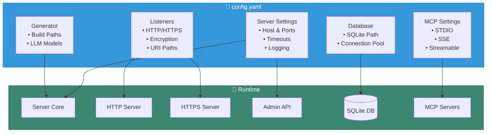

# Server Configuration

This guide provides detailed information about configuring the Virga C2 server.

## Configuration Overview

The Virgaer uses a YAML configuration file that controls:
- Server binding and ports
- Database settings  
- Listener configuration
- Generator settings
- Logging options
- MCP integration

## Configuration Architecture



## Configuration File Structure

### Complete Configuration Example

```yaml
# config.yaml

# Server core settings
server:
  # Network binding
  host: "0.0.0.0"              # Bind address
  admin_port: 8443              # Admin API port
  
  # Session management
  session_timeout: "30m"        # Inactive session timeout
  
  # Logging
  log_level: "info"             # debug, info, warn, error, off
  log_path: "logs/server.log"   # Log file path

# Database configuration (SQLite only)
database:
  type: "sqlite3"               # Database type
  path: "data/virga.db"    # Database file path

# Listener configuration
listeners:
  - name: "primary-https"
    type: "https"               # http or https
    bind_address: "0.0.0.0"
    port: 443
    
    # URI configuration
    uri_path: "api/updates"     # Beacon check-in path
    
    # SSL/TLS settings (HTTPS only)
    ssl:
      cert: "/path/to/server.crt"
      key: "/path/to/server.key"
      
    # Encryption settings
    encryption:
      type: "aes-256"
      key: "your-encryption-key-here"  # Any string (normalized to 32 bytes)
      
  - name: "backup-http"
    type: "http"
    bind_address: "0.0.0.0"
    port: 8080
    uri_path: "api/updates"
    encryption:
      type: "aes-256"
      key: "0123456789abcdef0123456789abcdef0123456789abcdef0123456789abcdef"

# Generator settings (for beacon generation)
generator:
  user_agent: "Mozilla/5.0 (Windows NT 10.0; Win64; x64) AppleWebKit/537.36 (KHTML, like Gecko) Chrome/96.0.4664.110 Safari/537.36"
  initial_sleep: 60             # Initial sleep time in seconds
  jitter: 20                    # Jitter percentage
  obfuscation: true             # Enable obfuscation
  anti_av: true                 # Anti-AV features
  anti_etw: true                # Anti-ETW features
  self_delete: false            # Self-delete after execution

# MCP (Model Context Protocol) settings
mcp:
  enabled: true                 # Enable MCP support

  # SSE transport
  sse_enabled: true
  sse_port: ":8444"
  sse_base_path: "/mcp"

  # Standard I/O transport
  stdio_enabled: false

  # Remote transport
  remote_enabled: true
  remote_base_url: "http://localhost:8444"

  # Streamable transport
  streamable_enabled: true
  streamable_port: ":50012"
```

## Configuration Sections

### Server Settings

The server section controls the core server behavior:

```yaml
server:
  host: "0.0.0.0"              # Listen on all interfaces
  admin_port: 8443              # Admin API port
  session_timeout: "30m"        # Session timeout duration
  log_level: "info"             # Logging level
  log_path: "logs/server.log"   # Log file location
```

**Fields:**
- `host`: IP address to bind to (default: "0.0.0.0")
- `admin_port`: Port for admin API and CLI connections
- `session_timeout`: Duration string for inactive session cleanup
- `log_level`: One of: debug, info, warn, error
- `log_path`: Path to log file

### Database Configuration

Currently, only SQLite3 is supported:

```yaml
database:
  type: "sqlite3"
  path: "data/virga.db"
```

**Fields:**
- `type`: Must be "sqlite3"
- `path`: Path to SQLite database file

### Listener Configuration

Listeners handle incoming beacon connections. For a conceptual overview and setup guide, see the [Listeners Guide](/guide/listeners.md).

The `listeners` block in `config.yaml` is an array of listener objects. See the guide for examples.


### Generator Settings

Controls default settings for beacon generation. These settings can be overridden during manual generation.

```yaml
generator:
  user_agent: "Mozilla/5.0..."
  initial_sleep: 60
  jitter: 20
  obfuscation: true
  anti_av: true
  anti_etw: true
  self_delete: false
```

**Fields:**
- `user_agent`: Default User-Agent string for HTTP(S) beacons.
- `initial_sleep`: Default initial sleep time in seconds for the beacon.
- `jitter`: Default jitter percentage (0-100) to randomize sleep intervals.
- `obfuscation`: (Default: `true`) Enable code obfuscation in the generated beacon.
- `anti_av`: (Default: `true`) Include anti-AV detection features.
- `anti_etw`: (Default: `true`) Include features to bypass Event Tracing for Windows (ETW).
- `self_delete`: (Default: `false`) Enable the beacon to delete itself after execution.

> **Note**: The `obfuscation`, `anti_av`, and `anti_etw` features are enabled by default to provide better operational security.

### MCP Configuration

Model Context Protocol (MCP) settings for AI/LLM integration.

```yaml
mcp:
  enabled: true
  sse_enabled: true
  sse_port: ":8444"
  sse_base_path: "/mcp"
  stdio_enabled: false
  remote_enabled: true
  remote_base_url: "http://localhost:8444"
  streamable_enabled: true
  streamable_port: ":50012"
```

**Fields:**
- `enabled`: Enable/disable all MCP functionalities.
- `sse_enabled`: Enable the Server-Sent Events (SSE) transport layer.
- `sse_port`: Port for the SSE server to listen on.
- `sse_base_path`: Base URL path for SSE endpoints.
- `stdio_enabled`: Enable the standard I/O transport (useful for local debugging).
- `remote_enabled`: Enable the remote transport layer.
- `remote_base_url`: The base URL for the remote MCP server.
- `streamable_enabled`: Enable the streamable transport layer.
- `streamable_port`: Port for the streamable transport server.

## Configuration Validation

The server validates the configuration file upon startup. If any checks fail, the server will exit with a fatal error.

```bash
# Start the server with your configuration
./bin/virga-server --config config.yaml
```

Common validation errors, as implemented in the code, include:

- **Missing Database Path**: The `database.path` field is required.
- **No Listeners Defined**: At least one listener must be configured under the `listeners` section.
- **Missing Listener Name**: Every listener must have a unique `name`.
- **Invalid Port Number**: Listener `port` must be between 1 and 65535.
- **Missing SSL Configuration**: If a listener has `use_ssl: true`, both `ssl.cert` and `ssl.key` paths must be provided.

> **Note**: The server does **not** currently validate the format of encryption keys or check for duplicate listener names upon startup. These checks may be added in future versions.

## Minimal Configuration

Here's a minimal configuration to get started:

```yaml
server:
  host: "0.0.0.0"
  admin_port: 8443

database:
  type: "sqlite3"
  path: "virga.db"

listeners:
  - name: "default"
    type: "http"
    bind_address: "0.0.0.0"
    port: 8080
    uri_path: "api/updates"
    encryption:
      type: "aes-256"
      key: "change-this-key-in-production"
```

## Production Configuration

For production deployments:

```yaml
server:
  host: "0.0.0.0"
  admin_port: 8443
  session_timeout: "30m"
  log_level: "warn"              # Less verbose logging
  log_path: "/var/log/virga/server.log"

database:
  type: "sqlite3"
  path: "/var/lib/virga/c2.db"

listeners:
  - name: "primary-https"
    type: "https"
    bind_address: "0.0.0.0"
    port: 443
    uri_path: "api/v2/updates"
    ssl:
      cert: "/etc/letsencrypt/live/c2.example.com/fullchain.pem"
      key: "/etc/letsencrypt/live/c2.example.com/privkey.pem"
    encryption:
      type: "aes-256"
      key: "${ENCRYPTION_KEY}"   # Use environment variable

generator:
  user_agent: "Mozilla/5.0 (Windows NT 10.0; Win64; x64) AppleWebKit/537.36"
  initial_sleep: 300             # 5 minutes
  jitter: 30                     # 30% jitter
  obfuscation: false             # Not implemented yet
  anti_av: false                 # Not implemented yet
  anti_etw: false                # Not implemented yet
```

## Planned Features

The following features are planned for future releases:

- **Database Support**: PostgreSQL and MySQL support
- **Additional Listeners**: DNS, SMB, and mTLS protocols
- **Authentication**: Token-based authentication, MFA, OAuth2
- **Advanced Logging**: Multiple outputs, log rotation, audit logging
- **Monitoring**: Prometheus metrics, health checks
- **Security Features**: Rate limiting, ACLs, GeoIP filtering
- **Configuration Management**: Hot reload, templates

## Troubleshooting

### Common Issues

1. **Port Already in Use**
   - Change the port in configuration
   - Check for other processes using the port

2. **Certificate Issues**
   - Ensure certificate and key files exist
   - Check file permissions
   - Verify certificate validity

3. **Database Lock**
   - Ensure only one server instance is running
   - Check database file permissions

4. **Encryption Key Invalid**
   - Key can be any string (will be normalized to 32 bytes)
   - For best security, use a 32-byte key or generate one: `openssl rand -base64 32`

### Debug Mode

Enable debug mode for detailed logging:

```bash
./bin/virga-server --config config.yaml --debug
```

## Logging Configuration

Virgaides comprehensive logging control for all components.

### Server Logging

#### Configuration File Settings

```yaml
server:
  log_level: "info"              # Log verbosity level
  log_path: "logs/server.log"    # Log file location
```

#### Command Line Options

```bash
# Set log level via command line
./bin/virga-server --log-level debug

# Enable debug mode (sets level to debug)
./bin/virga-server --debug

# Disable all logging
./bin/virga-server --no-log
```

#### Environment Variables

```bash
# Set default log level
export VIRGA_SERVER_LOG_LEVEL=debug
./bin/virga-server
```

#### Priority Order

1. Command-line flags (highest priority)
2. Environment variables
3. Configuration file
4. Default values (lowest priority)

### CLI Logging

```bash
# Command line options
./bin/virga-cli --log-level debug
./bin/virga-cli --quiet  # Sets level to ERROR

# Environment variable
export VIRGA_CLI_LOG_LEVEL=info
```

### Implant Logging

Configure during beacon generation:

```yaml
# In beacon configuration
logging:
  enabled: true
  level: "info"           # debug, info, warn, error, off
  llama_log: true         # Enable LLM logs
  execution_log: true     # Enable command execution logs
```

Runtime control via session commands:
```bash
> log status              # Check current status
> log level debug         # Change log level
> log disable             # Disable logging
> log enable              # Enable logging
```

### Log Levels

- `DEBUG`: Detailed debug information
- `INFO`: General informational messages
- `WARN`: Warning messages
- `ERROR`: Error messages only
- `OFF`: Disable all logging

### Performance Considerations

- DEBUG level can impact performance
- Consider ERROR or OFF for production
- Log file I/O affects implant stealth
- Use log rotation for long-running servers

## Next Steps

- Review [Quick Start](/guide/quick-start) guide
- Learn about [Beacon Generation](/usage/beacon-generation)
- Check [Troubleshooting](/reference/troubleshooting) for issues