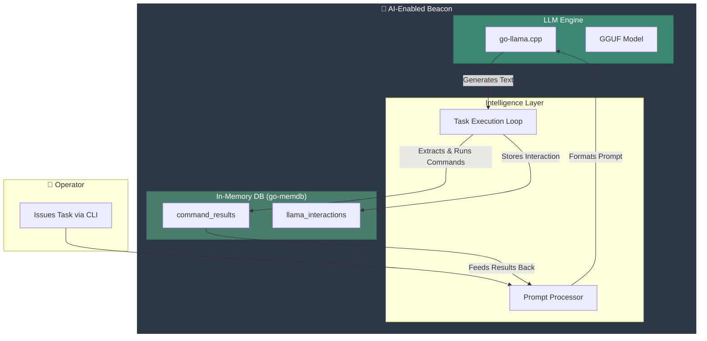

# AI Integration Features

This document outlines the AI capabilities integrated into Virga, powered by a locally run LLM model.

## Core Architecture

Virga features are built around an embedded LLM engine that runs directly within the beacon. This allows for autonomous operations and intelligent analysis on the target system without constant operator intervention. The key components are:

1.  **LLM Engine**: Utilizes `go-llama.cpp` bindings to run a GGUF-formatted language model.
2.  **In-Memory Database (MemDB)**: A `go-memdb` instance that stores all operational data during the beacon's lifecycle, including command results and AI interactions. **This is not a persistent SQLite database.**
3.  **Task Executor**: A loop within the llama engine that interprets the model's output, executes system commands, and feeds the results back into the model for further analysis.



## How It Works: The Autonomous Loop

The core of the AI's capability is a loop that allows the model to "think" and act:

1.  **Prompt**: The operator provides an initial prompt (e.g., "Analyze this system for security weaknesses").
2.  **Inference**: The LLM model generates a response based on the prompt.
3.  **Action**: The beacon's code scans the model's response for a special `[EXECUTE: command]` marker.
4.  **Execution**: If a marker is found, the specified `command` is executed on the target system.
5.  **Feedback**: The output of the command is fed back into the LLM model as new context.
6.  **Iteration**: The model analyzes the command output and decides on the next step, generating a new response. This loop continues until the task is complete or a set number of iterations is reached.

This process allows the beacon to perform tasks like detecting the operating system (`echo %OS%`), then running OS-specific commands (`systeminfo` or `uname -a`) to gather information autonomously.

## Key Capabilities

- **Autonomous Reconnaissance**: The AI can independently perform system enumeration, user analysis, and network discovery by chaining commands based on previous results.
- **Adaptive Command Execution**: The AI attempts to run commands appropriate for the detected operating system (Windows or Linux).
- **Structured Data Collection**: The model is prompted to return key information using a `[FINDING: key: value]` marker, which can be parsed for structured logging.

## Configuration

AI features are configured in your beacon configuration file (e.g., `configs/beacon.yaml`). This provides fine-grained control over the model's behavior.

```yaml
llama:
  enabled: true
  log_enabled: true
  model:
    context: 8192
    gpu_layers: 0
    threads: 4
    temperature: 0.7
    top_k: 40
    top_p: 0.95
    max_tokens: 2048

  prompt:
    preset: "enhanced" # Options: default, enhanced, stealth, aggressive

  autonomous:
    enabled: true
    initial_tasks:
      - type: "system_reconnaissance"
        description: "Complete system analysis and environment mapping"
      - type: "user_activity"
        description: "Monitor and analyze user behavior patterns"
      - type: "network_discovery"
        description: "Map network topology and discover connected systems"

    max_iterations: 50
    timeout_minutes: 15
    report_interval: 300
```

## Using AI Features via the CLI

Once you are interacting with an AI-enabled beacon, you can use the `llama` and `memdb` commands.

### `llama` command

- `llama prompt "<your objective>"`: Kicks off an autonomous task with your specified goal.
- `llama auto`: Starts the pre-defined autonomous tasks configured in `beacon.yaml`.
- `llama stop`: Stops the current AI task.
- `llama status`: Shows the current status of the AI engine.

**Example:**
```bash
virga (session)> llama prompt "Find all running processes not signed by Microsoft"
[*] Sending prompt to Llama AI...
```

### `memdb` command

- `memdb query "<query>"`: Query the in-memory database. (Note: query functionality is limited).
- `memdb dump`: Dumps the contents of the `llama_interactions` and `command_results` tables from the beacon's memory.

**Example:**
```bash
virga (session)> memdb dump
[*] Dumping MemDB contents...
--- llama_interactions ---
ID: ..., TaskID: ..., Prompt: "Find all running processes...", ...
---
```

## Enabling AI in Beacons

To create a beacon with AI capabilities, you must:

1.  **Download Dependencies**: Run `make download-llama-deps` on the server to fetch the required model and libraries.
2.  **Enable in Config**: Set `llama.enabled: true` in your `beacon.yaml` file.
3.  **Generate**: Build the beacon using `generate beacon --config beacon.yaml`.

Alternatively, you can use the `--enable-llama` flag as a shortcut:

```bash
virga> generate beacon --os windows --arch amd64 --enable-llama
```


## Default LLM Model

The default LLM model is **TinyLlama-1.1B-Chat-v1.0-GGUF** (Q4_K_M quantization, ~669MB). This model provides a good balance between size and performance for embedded AI operations.

### Downloading the Model

To download the default model along with required libraries:

```bash
# Download model and libraries for current platform only
make download-llama-deps

# Or download libraries for all platforms and the model
make download-llama-all
```

### Changing the Default Model

You can use a different GGUF-format model by modifying `scripts/download-llama-model.go`:

```go
const (
    modelURL  = "https://huggingface.co/TheBloke/TinyLlama-1.1B-Chat-v1.0-GGUF/resolve/main/tinyllama-1.1b-chat-v1.0.Q4_K_M.gguf" // <- Change this URL
    modelPath = "internal/implant/llama/models/model.gguf"  // DO NOT change this path
)
```

#### Compatible Models

Based on the embedded llama.cpp version (commit `ac43576`), the following model families are supported:

| Model Family | Examples | Notes |
|--------------|----------|-------|
| **LLaMA / LLaMA 2** | TinyLlama, Llama-2-7B, Llama-2-13B | Most widely supported |
| **Falcon** | Falcon-7B, Falcon-40B | Alternative architecture |
| **Alpaca** | Alpaca-7B, Alpaca-13B | Fine-tuned LLaMA |
| **Vicuna** | Vicuna-7B, Vicuna-13B | Chat-optimized |
| **GPT4All** | GPT4All-J, GPT4All-Snoozy | Optimized for CPU |
| **WizardLM** | WizardLM-7B, WizardLM-13B | Instruction-following |
| **Baichuan** | Baichuan-7B | Chinese language model |
| **OpenBuddy** | OpenBuddy-7B | Multilingual support |

#### Recommended GGUF Models

| Model | Size | Use Case | Download |
|-------|------|----------|----------|
| **TinyLlama-1.1B Q4_K_M** | ~669MB | Default, balanced performance | [HuggingFace](https://huggingface.co/TheBloke/TinyLlama-1.1B-Chat-v1.0-GGUF) |
| **TinyLlama-1.1B Q8_0** | ~1.2GB | Higher quality responses | [HuggingFace](https://huggingface.co/TheBloke/TinyLlama-1.1B-Chat-v1.0-GGUF) |
| **Vicuna-7B Q4_K_M** | ~3.8GB | Better chat capabilities | [HuggingFace](https://huggingface.co/TheBloke/vicuna-7B-v1.5-GGUF) |
| **WizardLM-7B Q4_K_M** | ~3.8GB | Better instruction following | [HuggingFace](https://huggingface.co/TheBloke/WizardLM-7B-GGUF) |

> **Important**: Only models in GGUF format from the supported families above will work. Models like Phi-2, Mistral, or others not listed in the supported families will not function with this llama.cpp version.

#### Steps to Change the Model

1. Choose a model from the supported families listed above
2. Find the GGUF version on [Hugging Face](https://huggingface.co/models?search=gguf) (search for "ModelName GGUF")
3. Copy the direct download URL (must end with `.gguf`)
4. Edit `scripts/download-llama-model.go` and update the `modelURL`
5. Run `make download-llama-deps` to download the new model

> **Note**: After changing the model, you must rebuild the beacon with `--enable-llama` for the changes to take effect.

#### Important Considerations

- **Model Size**: Larger models require more memory in the implant
- **Quantization**: Lower quantization (Q2, Q3) reduces quality but saves space
- **Compatibility**: Only GGUF format models are supported
- **Performance**: Model inference speed depends on target system resources
- **Security**: Only download models from trusted sources to avoid malicious code
- **Testing**: Always test new models thoroughly before production deployment