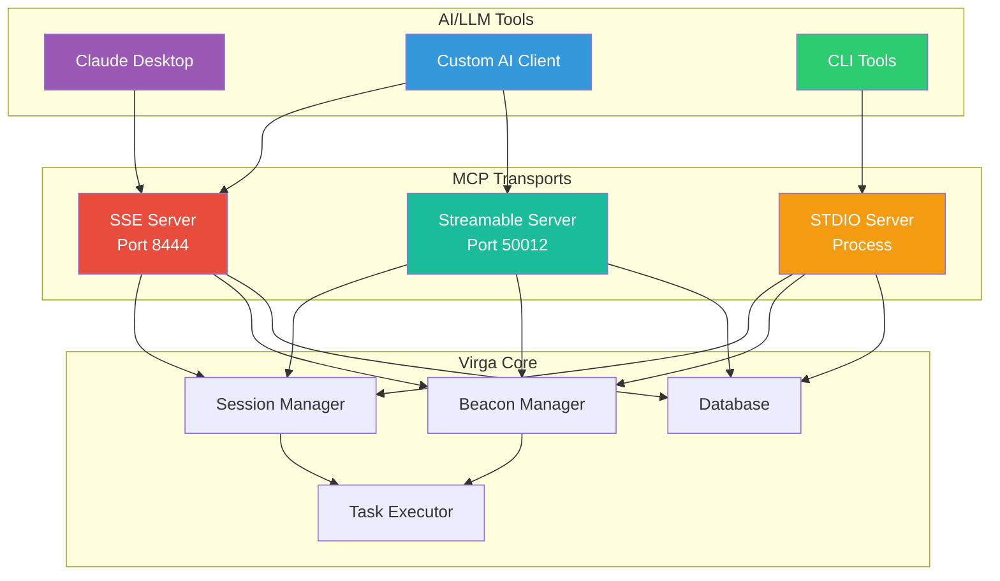

# MCP Integration

This document describes how to use the Model Context Protocol (MCP) integration in Virga, which enables AI/LLM tools to interact with the C2 framework through multiple transport protocols.

## Overview

The Model Context Protocol (MCP) is an open standard that allows AI assistants and LLM tools to securely interact with external systems. Virga implements MCP to enable:

- AI-powered security analysis and automation
- Interactive session management through AI assistants
- Natural language command execution
- Intelligent data querying and analysis

## Architecture

Virga's MCP implementation supports three transport protocols, each suited for different use cases:

### Transport Comparison

| Feature              | SSE                | STDIO           | Streamable      |
| -------------------- | ------------------ | --------------- | --------------- |
| **Tools**            | 9 tools            | 9 tools         | 14 tools        |
| **Resources**        | 7 (with templates) | 3 (static only) | 4               |
| **Protocol**         | HTTP + SSE         | Process I/O     | HTTP Stateful   |
| **Real-time**        | Yes (events)       | No (sync)       | Yes (streaming) |
| **Best for**         | Web clients        | CLI tools       | Custom apps     |
| **Interactive Mode** | No                 | No              | Yes             |
| **Port Required**    | Yes (8444)         | No              | Yes (50012)     |



## Transport Protocols

### 1. SSE (Server-Sent Events)

Best for web-based clients and real-time event streaming.

**Features:**
- HTTP-based with event streaming
- Suitable for browser integration
- Real-time updates
- Firewall-friendly

**Default Configuration:**
```yaml
mcp:
    sse_base_path: /mcp
    sse_enabled: true
    sse_port: :8444
    remote_enabled: false
    remote_base_url: http://localhost:8444
```

### 2. STDIO (Standard Input/Output)

Best for CLI tools and local integrations.

**Features:**
- JSON-RPC over standard I/O
- Process-based communication
- Synchronous request/response
- Ideal for scripting

**Default Configuration:**
```yaml
mcp:
    stdio_enabled: false
```

### 3. Streamable

Best for high-performance, custom integrations.

**Features:**
- Binary protocol support
- Bidirectional streaming
- Low latency
- Custom protocol implementation

**Default Configuration:**
```yaml
mcp:
    streamable_enabled: true
    streamable_port: :50012
```

## Configuration

### Server Configuration

Add MCP settings to your `configs/server.yaml`:

```yaml
# MCP Configuration
mcp:
    enabled: true
    # SSE transport settings
    sse_enabled: true
    sse_port: :8444
    sse_base_path: /mcp

    # STDIO transport settings
    stdio_enabled: false  # Enable for CLI usage

    # Streamable transport settings
    streamable_enabled: true
    streamable_port: :50012

    # Remote access settings (for SSE)
    remote_enabled: false
    remote_base_url: http://localhost:8444
```

### Starting MCP Servers

MCP servers start automatically with the main Virga server when enabled:

```bash
# Start Virga with MCP
./virga-server -config configs/server.yaml

# Output:
# [INFO] Starting MCP SSE server on :8444...
# [INFO] MCP SSE server started
```

## Available Tools

The available tools vary by transport protocol:

### SSE and STDIO Transports (9 tools)

Both SSE and STDIO transports provide the same comprehensive set of tools:

#### Session Management
- **`session_list`** - List all active C2 sessions
- **`session_command`** - Execute commands in a session
  - Supports shell commands, Llama AI prompts, and MemDB queries
  - Use `use_llama: true` for AI interpretation
  - Prefix with `memdb ` for database queries

#### File Operations
- **`upload_file`** - Upload files to target systems
- **`download_file`** - Download files from targets

#### System Operations
- **`list_processes`** - List running processes
- **`kill_process`** - Terminate processes by PID
- **`get_system_info`** - Gather system information

#### Network Operations
- **`list_network_connections`** - List network connections
- **`port_forward`** - Set up port forwarding

### Streamable Transport (14 tools)

The Streamable transport includes all the standard tools plus additional real-time capabilities:

#### Core Tools (Same as SSE/STDIO) - 9 tools
- **`session_list`** - List all active C2 sessions
- **`session_command`** - Execute commands (shell, Llama, MemDB)
- **`upload_file`** - Upload files to target systems
- **`download_file`** - Download files from targets
- **`list_processes`** - List running processes
- **`kill_process`** - Terminate processes by PID
- **`get_system_info`** - Gather system information
- **`list_network_connections`** - List network connections
- **`port_forward`** - Set up port forwarding

#### Additional Streamable-Only Tools - 5 tools
- **`get_system_status`** - Get Virga system status
- **`interact_beacon`** - Start interactive session (1-second check-ins)
- **`stop_interact`** - Stop interactive session (return to 30-second check-ins)
- **`shell`** - Direct shell command execution (alias for session_command)
- **`ls`** - List files (executes `ls -la`)

## Client Integration Examples

### Claude Desktop Integration

1. Install Claude Desktop
2. Configure MCP in Claude's configuration:

```json
{
  "mcpServers": {
    "virga": {
      "command": "curl",
      "args": ["-N", "http://localhost:8444/mcp/events"],
      "env": {}
    }
  }
}
```

3. Claude can now interact with your C2 sessions:
```
"List all active sessions and show me their details"
"Execute 'whoami' on session-123"
"Find all PDF files on the target system"
```

### Python Client Example

```python
import asyncio
from mcp import Client
from mcp.client.sse import SSEClientTransport

async def main():
    # Create SSE transport
    transport = SSEClientTransport("http://localhost:8444/mcp")

    # Initialize client
    async with Client("virga-client", "1.0.0") as client:
        await client.connect(transport)
        await client.initialize()

        # List sessions
        result = await client.call_tool("session_list", {})
        print(f"Active sessions: {result}")

        # Execute command with AI
        result = await client.call_tool("session_command", {
            "session_id": "session-123",
            "command": "Find and analyze suspicious network connections",
            "use_llama": True,
            "temperature": 0.7
        })
        print(f"Task ID: {result['task_id']}")

        # Use file operations
        # Upload a file
        result = await client.call_tool("upload_file", {
            "session_id": "session-123",
            "remote_path": "/tmp/test.txt",
            "content": "SGVsbG8gV29ybGQ="  # Base64 encoded "Hello World"
        })
        print(f"Upload result: {result}")

        # List processes
        result = await client.call_tool("list_processes", {
            "session_id": "session-123"
        })
        print(f"Processes: {result}")

        # Get system info
        result = await client.call_tool("get_system_info", {
            "session_id": "session-123"
        })
        print(f"System Info: {result}")

asyncio.run(main())
```

### JavaScript/TypeScript Example

```typescript
import { Client } from "@modelcontextprotocol/sdk/client/index.js";
import { SSEClientTransport } from "@modelcontextprotocol/sdk/client/sse.js";

async function interactWithVirga() {
  const transport = new SSEClientTransport(
    new URL("http://localhost:8444/mcp")
  );

  const client = new Client({
    name: "virga-js-client",
    version: "1.0.0",
  }, {
    capabilities: { tools: {} }
  });

  await client.connect(transport);

  // Execute AI-powered analysis
  const result = await client.callTool({
    name: "session_command",
    arguments: {
      session_id: "session-123",
      command: "Analyze system for persistence mechanisms",
      use_llama: true,
      max_iterations: 5
    }
  });

  console.log("Analysis started:", result.task_id);
}
```

## Use Cases

### 1. AI-Powered Security Analysis

```python
# Use AI to analyze a compromised system
result = await client.call_tool("session_command", {
    "session_id": session_id,
    "command": """
    Perform a comprehensive security analysis:
    1. Check for suspicious processes
    2. Identify unusual network connections
    3. Find recently modified system files
    4. Look for persistence mechanisms
    5. Generate a summary report
    """,
    "use_llama": True,
    "max_iterations": 20,
    "temperature": 0.3
})

# Or use individual tools for specific tasks
processes = await client.call_tool("list_processes", {
    "session_id": session_id
})

connections = await client.call_tool("list_network_connections", {
    "session_id": session_id
})

# Query MemDB through session_command
history = await client.call_tool("session_command", {
    "session_id": session_id,
    "command": "memdb SELECT * FROM commands WHERE exit_code != 0 LIMIT 10"
})
```

### 2. Automated Incident Response

```python
# Automated response to detected threats
async def respond_to_threat(session_id, threat_info):
    # Kill malicious process
    await client.call_tool("kill_process", {
        "session_id": session_id,
        "pid": threat_info["pid"]
    })

    # Download suspicious files for analysis
    await client.call_tool("download_file", {
        "session_id": session_id,
        "remote_path": threat_info.get("executable_path")
    })

    # Get process information
    processes = await client.call_tool("list_processes", {
        "session_id": session_id
    })

    # Query related data through MemDB
    await client.call_tool("session_command", {
        "session_id": session_id,
        "command": f"memdb SELECT * FROM processes WHERE parent_pid = {threat_info['pid']}"
    })
```

### 3. Natural Language Operations

```python
# Let AI handle complex multi-step operations
commands = [
    "Find all user accounts created in the last 30 days",
    "Check if any of these accounts have administrative privileges",
    "List all files accessed by these accounts",
    "Create a timeline of suspicious activities"
]

for cmd in commands:
    result = await client.call_tool("session_command", {
        "session_id": session_id,
        "command": cmd,
        "use_llama": True
    })
    task_ids.append(result["task_id"])
```

## Advanced Features

### Llama Integration

Commands can leverage the embedded AI model through the `session_command` tool:

```python
# AI interprets and executes the intent
result = await client.call_tool("session_command", {
    "session_id": "session-123",
    "command": "Check if this system has been compromised",
    "use_llama": True,
    "temperature": 0.5,  # Lower = more focused
    "max_iterations": 10  # Max reasoning steps
})
```

### MemDB Queries

Query the in-memory database directly or through session_command:

```python
# Query MemDB via session_command with memdb prefix
result = await client.call_tool("session_command", {
    "session_id": "session-123",
    "command": "memdb SELECT * FROM commands WHERE module = 'shell' LIMIT 10"
})

# Another MemDB query example
result = await client.call_tool("session_command", {
    "session_id": "session-123",
    "command": "memdb SELECT * FROM processes WHERE name LIKE '%suspicious%'"
})

# Get MemDB status through session_command
status = await client.call_tool("session_command", {
    "session_id": "session-123",
    "command": "memdb status"
})
```

### Resource Access

MCP provides read-only resources that vary by transport:

#### SSE Transport Resources (7 total)

Static resources:
- `sessions://list` - All active sessions
- `beacons://list` - All configured beacons
- `system://status` - System status

Dynamic resources (templates):
- `sessions://detail/{session_id}` - Specific session details
- `beacons://detail/{beacon_id}` - Specific beacon details
- `history://commands/{session_id}` - Command execution history
- `files://session/{session_id}` - File operation history

#### STDIO Transport Resources (3 total)

- `sessions-list` - All active sessions
- `beacons-list` - All configured beacons
- `system-status` - System status

#### Streamable Transport Resources (4 total)

- `virga://sessions/overview` - Sessions overview
- `virga://session/{id}/info` - Specific session information
- `virga://beacons/overview` - Beacons overview
- `virga://system/stats` - System statistics

Example usage:
```python
# SSE/STDIO resource access
resource = await client.read_resource("sessions://list")  # SSE
resource = await client.read_resource("sessions-list")    # STDIO

# Streamable resource access
resource = await client.read_resource("virga://sessions/overview")
resource = await client.read_resource(f"virga://session/{session_id}/info")
```

## Security Considerations

1. **Authentication**: Currently, MCP servers have limited authentication. Use network-level security:
   - Bind to localhost only for local integrations
   - Use VPN or SSH tunnels for remote access
   - Implement firewall rules

2. **Authorization**: All connected clients have full access. Future versions will add:
   - Token-based authentication
   - Role-based access control
   - Session-level permissions

3. **Encryption**: For production use:
   - Use HTTPS/TLS for SSE transport
   - Tunnel STDIO through SSH
   - Enable transport-level encryption

4. **Input Validation**: The server validates all inputs, but clients should also:
   - Sanitize user inputs
   - Validate session IDs
   - Handle errors gracefully

## Troubleshooting

### SSE Connection Issues

```bash
# Test SSE endpoint
curl -N http://localhost:8444/mcp/events

# Check if events are flowing
# You should see:
# event: open
# data: {"id":"...","timestamp":"..."}
```

### STDIO Communication

```bash
# Test STDIO server
echo '{"jsonrpc":"2.0","id":1,"method":"system/info","params":{}}' | \
  ./virga-server -mcp-stdio

# Enable debug logging
export VIRGA_LOG_LEVEL=debug
```

### Common Issues

1. **"Session not found" errors**
   - Verify session ID is correct
   - Check if session is still active
   - Ensure proper connection to C2 server

2. **Timeout errors**
   - Increase timeout for long operations
   - Check network connectivity
   - Verify target system is responsive

3. **JSON parsing errors**
   - Validate JSON syntax
   - Check character encoding (UTF-8)
   - Ensure proper escaping

4. **Tool not found errors**
   - Verify tool name is correct (e.g., `upload_file` not `file_upload`)
   - Check transport type (some tools are transport-specific)
   - Ensure server has MCP enabled

5. **Tool naming**
   - Use exact tool names as documented
   - Common mistakes: `file_upload` should be `upload_file`
   - Check the specific transport's tool list

## Best Practices

1. **Use appropriate transports**:
   - SSE for web/real-time applications
   - STDIO for scripts and automation
   - Streamable for high-performance needs

2. **Handle asynchronous operations**:
   - Store task IDs for long-running operations
   - Implement proper polling for results
   - Handle partial results gracefully

3. **Optimize AI usage**:
   - Use lower temperatures (0.1-0.3) for precise tasks
   - Increase iterations for complex analysis
   - Cache results to avoid redundant processing

4. **Monitor resource usage**:
   - MCP operations can be resource-intensive
   - Monitor memory usage with AI operations
   - Implement rate limiting for production

## Future Enhancements

Planned improvements for MCP integration:

1. **WebSocket support** for bidirectional streaming
2. **GraphQL API** for flexible queries
3. **Batch operations** for efficiency
4. **Event subscriptions** for real-time updates
5. **Plugin system** for custom tools
6. **Audit logging** for compliance

## References

- [Model Context Protocol Specification](https://github.com/modelcontextprotocol/modelcontextprotocol)
- [go-mcp Library Documentation](https://github.com/ThinkInAIXYZ/go-mcp)
- [Virga API Reference](/reference/api-reference)
- [Session Management Guide](/guide/sessions)